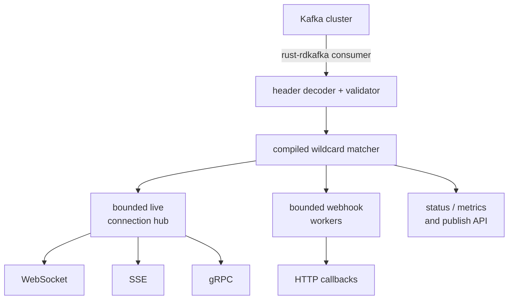

# Kafka Edge Router

High-performance and low-latency Rust daemon that consumes Kafka records and routes them to filtered
WebSocket, Server-Sent Events, gRPC, and outbound HTTP webhook subscribers.

[](https://github.com/andrii2g/kafka-edge-router/actions/workflows/ci.yml)
[](LICENSE)
[](https://www.rust-lang.org/)




## What is already implemented

This repository is an implementation scaffold, not a diagram-only starter. It contains:

- a Cargo workspace with six focused crates;
- a tenant-isolated, exact/wildcard route index;
- at most 64 direct route lookups for six populated optional dimensions;
- one bounded queue per connection or webhook destination;
- duplicate-match coalescing per connection;
- configurable slow-consumer eviction;
- Kafka header decoding without parsing payloads for routing;
- explicit Kafka offset commits after local routing policy has completed;
- an idempotent Kafka producer for HTTP and gRPC publishing;
- WebSocket subscribe, unsubscribe, ping, and live delivery;
- fixed-filter SSE streams with keep-alives and reconnect-compatible message ids;
- gRPC server streaming, bidirectional streaming, publishing, and status;
- static HTTP webhook destinations with ordering, timeouts, retries, HMAC signing,
  no redirects, hostname allowlists, and literal private-IP rejection;
- health, readiness, status, and Prometheus-format metrics endpoints;
- graceful `SIGINT`/`SIGTERM` shutdown;
- local Kafka, container, Kubernetes, systemd, CI, examples, and smoke-test files;
- Kafka-backed durable webhook commands, restart-safe retries, and dead letters;
- an ordered Codex execution backlog in [`tasks/`](tasks/README.md).

The production-hardening boundary is explicit. DNS-aware SSRF enforcement, JWT/JWKS
authentication, TLS termination, cluster peer forwarding,
and end-to-end durable client sessions are deliberately tracked as follow-on tasks
rather than being implied by an unsafe placeholder.

## Design invariants

1. **The matcher never parses the payload.** Route dimensions come from Kafka headers.
2. **The hot path never waits for network I/O.** It uses bounded `try_send` fan-out.
3. **No queue is unbounded.** Slow consumers are disconnected after a configured number
   of queue-full outcomes.
4. **A connection belongs to one tenant.** Every subscription must use that tenant.
5. **Payload bytes are copied once from Kafka and shared with `Arc`/`Bytes`.**
6. **Webhooks do not run inside the Kafka consumer task.** Each destination has its own
   ordered worker and queue.
7. **Live client delivery is best effort.** Duplicate Kafka records are possible and
   clients must deduplicate by `message_id`.
8. **Ordering is defined by Kafka partition.** Choose message keys for the entity whose
   ordering matters.

See [`docs/ARCHITECTURE.md`](docs/ARCHITECTURE.md) and
[`docs/DELIVERY_SEMANTICS.md`](docs/DELIVERY_SEMANTICS.md).

## Quick start

### Prerequisites

- Rust 1.88 or newer, with `rustfmt` and `clippy`;
- Docker with Compose for the local Kafka broker;
- `curl`; and
- optionally `grpcurl` and a modern browser for protocol examples.

#### Windows and WSL

Codex runs Windows-native commands and invokes Linux tooling, including Docker, through
the WSL distribution configured by `WSL_DISTRIBUTION` in [`AGENTS.md`](AGENTS.md). List
the distributions installed on your machine from PowerShell:

```powershell
wsl --list --quiet
```

If the configured name does not match your installation, update only the
`WSL_DISTRIBUTION` value in `AGENTS.md` (for example, `Ubuntu-24.04`).

### Start Kafka and create the input topic

```bash
./scripts/dev-up.sh
```

The local Compose file starts Apache Kafka on `localhost:9092` and creates a
six-partition `router.input` topic.

### Run the daemon

```bash
cargo run -p routerd -- --config config/router.toml
```

Expected listeners:

```text
HTTP / WebSocket / SSE  127.0.0.1:8080
public gRPC             127.0.0.1:9090
Kafka                   127.0.0.1:9092
```

The checked-in local configuration uses authentication mode `disabled` with tenant
`tenant-demo`. This is intentionally unsuitable for a public deployment.

### Subscribe

Open [`examples/websocket-client.html`](examples/websocket-client.html), or connect
with any WebSocket client and send:

```json
{
  "operation": "subscribe",
  "subscription_id": "news-for-team-17",
  "filter": {
    "kind": "content",
    "type": "broadcast",
    "channel": "news",
    "audience_type": "team",
    "audience_id": "team-17"
  }
}
```

For SSE:

```bash
curl -N 'http://127.0.0.1:8080/v1/events?tenant_id=tenant-demo&kind=content&channel=news'
```

The browser example is [`examples/sse-client.html`](examples/sse-client.html). SSE
reconnects resume live delivery only; `Last-Event-ID` is accepted but no missed events
are replayed.

For gRPC, use the commands in [`examples/grpcurl.md`](examples/grpcurl.md).

### Publish

```bash
./scripts/publish-example.sh
```

The HTTP publish endpoint accepts exactly one JSON `payload` or base64
`payload_base64`, publishes it to Kafka, and returns the broker partition and offset.
Publishing requires the tenant to be listed in `auth.publish_tenants`. The Kafka
consumer then receives the record and routes it to matching subscribers.

### Smoke test

With Kafka and the daemon running:

```bash
./scripts/smoke-test.sh
```

## Public endpoints

| Method | Path | Purpose |
|---|---|---|
| `GET` | `/health/live` | Process liveness |
| `GET` | `/health/ready` | Traffic readiness |
| `GET` | `/metrics` | Prometheus text exposition |
| `GET` | `/v1/status` | Runtime cardinalities and counters |
| `POST` | `/v1/publish` | Publish JSON or base64-encoded bytes to Kafka |
| `GET` | `/v1/ws` | Upgrade to a dynamic WebSocket session |
| `GET` | `/v1/events` | Open a fixed-filter SSE stream |

The gRPC contract is
[`crates/router-proto/proto/router/v1/router.proto`](crates/router-proto/proto/router/v1/router.proto).

## Observability

Prometheus metrics use fixed `stage`, `protocol`, and rebalance-event labels. Optional OTLP/HTTP
traces propagate bounded W3C trace headers, and readiness can depend on recent Kafka health with
hysteresis. See [the observability runbook](docs/OBSERVABILITY.md), the
[Grafana dashboard](deploy/observability/grafana-dashboard.json), and the
[Prometheus alert rules](deploy/observability/prometheus-alerts.yaml).

## Kafka record contract

Routing metadata should be encoded as Kafka headers. Only `x-tenant-id` is mandatory;
`x-message-id` falls back to `topic:partition:offset`, and `x-content-type` falls back
to `application/octet-stream`.

| Header | Required | Meaning |
|---|---:|---|
| `x-message-id` | no | Stable idempotency key |
| `x-tenant-id` | yes | Tenant boundary |
| `x-kind` | no | Domain category |
| `x-type` | no | Domain subtype |
| `x-channel` | no | Logical channel |
| `x-actor-id` | no | Actor identifier |
| `x-audience-type` | paired | Audience category |
| `x-audience-id` | paired | Audience identifier |
| `x-content-type` | no | Payload MIME type |
| `traceparent` | no | Bounded W3C remote trace parent |
| `tracestate` | paired | Optional W3C vendor trace state |

A recommended Kafka key is:

```text
tenant_id:audience_type:audience_id
```

When no audience exists, use:

```text
tenant_id:channel:channel_id
```

The complete contract is in [`docs/MESSAGE_CONTRACT.md`](docs/MESSAGE_CONTRACT.md).

## Subscription matching

A filter has one mandatory tenant and six optional exact dimensions. Omitted optional
dimensions are wildcards:

```json
{
  "tenant_id": "tenant-demo",
  "kind": "content",
  "channel": "news"
}
```

For a message with all six optional dimensions populated, the matcher constructs all
exact/wildcard combinations and performs `2^6 = 64` hash lookups. It does not scan all
subscriptions. A connection matching several filters receives one queue item containing
all matching subscription ids.

Payload-expression filters are intentionally unsupported. They introduce payload
parsing, unpredictable latency, authorization complexity, and denial-of-service risk.

## Delivery semantics

The default semantics are:

```text
Kafka -> router       at least once
router -> live client best effort
router -> webhook     explicit volatile or Kafka-backed durable mode
ordering              Kafka partition order
duplicates            possible
```

An offset is committed after the record is valid and has been accepted or intentionally
dropped according to the configured local queue policy. This is not an end-to-end
acknowledgement. A process crash can still occur between offset commit and socket write.
Every consumer must use `message_id` as an idempotency key.

`webhooks.mode = "volatile"` retains bounded in-memory retry and restart loss.
`webhooks.mode = "durable"` persists matched commands before source commit, resumes
persisted retries after restart, and publishes exhausted/permanent failures to a
dead-letter topic. See [`docs/WEBHOOK_OPERATIONS.md`](docs/WEBHOOK_OPERATIONS.md).

## Authentication modes

`auth.mode` supports:

- `disabled`: local development only; tenant comes from the request or
  `auth.default_tenant`;
- `static_bearer`: maps opaque bearer tokens to exactly one tenant;
- `trusted_header`: trusts a tenant header supplied by an already authenticated reverse
  proxy.

All subscriptions are rewritten to the authenticated tenant. A caller cannot use a
filter or publish request to cross that boundary.

Production should add TLS and use either a validated JWT/JWKS implementation or a
trusted identity-aware proxy. See [`docs/SECURITY.md`](docs/SECURITY.md).

## Configuration

Validate a file without starting listeners:

```bash
cargo run -p routerd -- --config config/router.toml --check-config
```

Environment variables overlay TOML using double underscores:

```bash
export ROUTER__SERVER__HTTP_ADDR=0.0.0.0:8080
export ROUTER__KAFKA__CONSUMER__BROKERS=kafka.internal:9092
export RUST_LOG=routerd=debug,router_core=trace
```

Use [`config/router.production.example.toml`](config/router.production.example.toml)
as a production checklist, not as a secret-management mechanism.

## Queue capacity limits

Every registered delivery queue is bounded by `router.max_queue_capacity`. Public WS,
SSE, and gRPC requests are further restricted by `api.max_stream_queue_capacity`; the
default live-stream queue must not exceed either cap. Static webhook queues are validated
against the core cap during configuration loading.

These caps limit queue slots, not total bytes. Size memory from maximum concurrent
connections, configured queue depth, payload size, and envelope overhead.

## Horizontal scaling

The MVP uses a **unique Kafka consumer group per router node**. Every node receives the
complete stream and dispatches only to clients connected to that node.

Advantages:

- no distributed subscription database;
- no router-to-router forwarding;
- clients can connect to any healthy node; and
- node failure handling remains ordinary Kafka and load-balancer behavior.

Cost: Kafka read and route-matching work is multiplied by router-node count. Measure this
before implementing the substantially more complex shared-group/peer-forwarding model.
The transition plan is in [`docs/ARCHITECTURE.md`](docs/ARCHITECTURE.md).

## Repository layout

```text
crates/router-core      matcher, queues, metrics, wire encoding
crates/router-kafka     Kafka decoder, consumer, producer
crates/router-api       HTTP, WebSocket, SSE, gRPC
crates/router-proto     protobuf contract and generated code
crates/router-webhook   outbound webhook validation and workers
crates/routerd          configuration and process composition
config/                 local and production example configuration
docs/                   architecture, contracts, operations, ADRs
tasks/                  ordered Codex implementation backlog
deploy/                 Kubernetes, systemd, and Docker guidance
examples/               browser, HTTP, and grpcurl examples
scripts/                local environment, smoke, and repository checks
```

## Development commands

```bash
make fmt
make lint
make test
make check
make validate
```

The committed `Cargo.lock` is enforced by local build targets, CI, container builds, and
release builds through `--locked`.

## Codex workflow

1. Read [`AGENTS.md`](AGENTS.md).
2. Read the selected task in [`tasks/`](tasks/README.md).
3. Inspect the named files before modifying anything.
4. Preserve every architecture invariant unless the task explicitly changes one.
5. Add tests before or with behavior changes.
6. Run the task's required checks.
7. Update `docs/IMPLEMENTATION_STATUS.md` and `CHANGELOG.md` when acceptance criteria
   are met.
8. Keep commits scoped to one task.

A ready-to-paste initial instruction is available in [`CODEX_PROMPT.md`](CODEX_PROMPT.md).

## Known production gaps

These are tracked rather than hidden:


- no DNS-resolution pinning/revalidation for webhook hosts;
- volatile webhook retries are not durable across restart; durable mode requires three operator-managed Kafka topics;
- authentication does not yet validate JWT signatures or JWKS rotation;
- public listeners do not terminate TLS themselves;
- no Kafka consumer-lag exporter integration;
- no histogram implementation for route and dispatch latency;
- no cluster peer-forwarding mode;
- no durable client acknowledgement/resume protocol;
- no completed high-cardinality load benchmark.

## License

- Apache License, Version 2.0;

