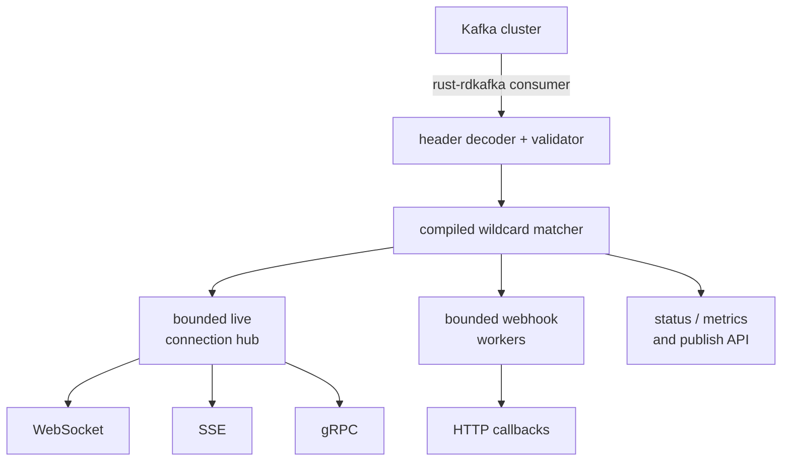

# Kafka Edge Router

High-performance, low-latency Rust daemon that consumes Kafka records and routes them to filtered WebSocket, Server-Sent Events, gRPC, and outbound HTTP webhook subscribers.

[](https://github.com/andrii2g/kafka-edge-router/actions/workflows/ci.yml)
[](LICENSE-APACHE)
[](https://www.rust-lang.org/)



## Contents

- [Kafka Edge Router](#kafka-edge-router)
  - [Contents](#contents)
  - [Capabilities](#capabilities)
  - [Design invariants](#design-invariants)
  - [Getting started](#getting-started)
  - [Interfaces and routing](#interfaces-and-routing)
    - [Public endpoints](#public-endpoints)
    - [Kafka message contract](#kafka-message-contract)
  - [Delivery and scaling](#delivery-and-scaling)
  - [Operations and security](#operations-and-security)
  - [Documentation](#documentation)
  - [Development](#development)
  - [Design and operational boundaries](#design-and-operational-boundaries)
  - [License](#license)

## Capabilities

Kafka Edge Router provides:

- tenant-isolated exact and wildcard routing from bounded Kafka headers;
- deterministic matching with at most 32 direct route lookups for five populated logical
  dimensions;
- bounded per-connection and per-webhook queues with configurable slow-consumer eviction;
- WebSocket dynamic subscriptions, SSE fixed-filter streams, and gRPC server and
  bidirectional streaming;
- HTTP and gRPC publishing through an idempotent Kafka producer;
- volatile and Kafka-backed durable webhook delivery with ordered retries, HMAC signing,
  SSRF controls, and dead-letter handling;
- JWT/JWKS, trusted-proxy, proxy-mTLS, static bearer, and local-development authentication
  modes;
- health, readiness, status, Prometheus metrics, and optional OTLP/HTTP tracing;
- graceful process shutdown and production deployment assets for containers, Kubernetes,
  and systemd; and
- reproducible integration, load, soak, security, and release verification workflows.

## Design invariants

1. **The matcher never parses payloads.** Route dimensions come from Kafka headers.
2. **The hot path never waits for network I/O.** Fan-out uses bounded `try_send`.
3. **No delivery queue is unbounded.** Persistent slow consumers are disconnected.
4. **Every connection belongs to one tenant.** Authentication determines the tenant boundary for all subscriptions and publishes.
5. **Payload bytes are copied once from Kafka.** Destinations share `Arc` and `Bytes`.
6. **Webhook HTTP calls never run in the Kafka consumer loop.**
7. **Every protocol envelope retains `message_id`.** Consumers use it for deduplication.
8. **Ordering is Kafka partition-local.** Message keys select the entity whose ordering
   matters.

The complete rationale is documented in [Architecture](docs/ARCHITECTURE.md), [Delivery semantics](docs/DELIVERY_SEMANTICS.md), and the [architecture decision records](docs/adr/README.md).

## Getting started

Follow the [Quick start guide](docs/QUICKSTART.md) to start the local Kafka broker, run the daemon, subscribe through a live protocol, publish an event, and execute the smoke test.

The checked-in local configuration is intended only for development. Production deployment starts with [`config/router.production.example.toml`](config/router.production.example.toml) and the [operations guide](docs/OPERATIONS.md).

## Interfaces and routing

### Public endpoints

| Method | Path | Purpose |
|---|---|---|
| `GET` | `/health/live` | Process liveness |
| `GET` | `/health/ready` | Traffic readiness |
| `GET` | `/metrics` | Prometheus text exposition |
| `GET` | `/v1/status` | Runtime cardinalities and counters |
| `POST` | `/v1/publish` | Publish JSON or base64-encoded bytes to Kafka |
| `GET` | `/v1/ws` | Upgrade to a dynamic WebSocket session |
| `GET` | `/v1/events` | Open a fixed-filter SSE stream |

The gRPC service supports fixed and bidirectional subscriptions, publishing, status,
health, and optional reflection. Stable request, response, error, and size-limit contracts
are defined in [Public protocol contracts](docs/PROTOCOLS.md). The source schema is
[`router.proto`](crates/router-proto/proto/router/v1/router.proto).

### Kafka message contract

Routing metadata is encoded as Kafka headers. Only `x-tenant-id` is mandatory;
`x-message-id` falls back to `topic:partition:offset`, and `x-content-type` falls
back to `application/octet-stream`.

A filter has one mandatory tenant and five optional exact dimensions: `kind`, `type`,
`channel`, `actor_id`, and the atomic `recipient_type` plus `recipient_identity` pair.
Omitted dimensions are wildcards. Tenant is never wildcardable. A fully populated message
produces at most `2^5 = 32` direct lookups rather than a scan of all subscriptions.
Recipient types are open bounded strings, so new categories do not require router changes.

See [Kafka message contract](docs/MESSAGE_CONTRACT.md) for headers, keys, examples, and
compatibility rules.

## Delivery and scaling

| Boundary | Semantics |
|---|---|
| Kafka to router | At least once |
| Router to live client | Bounded, best effort |
| Router to webhook | Explicit volatile or Kafka-backed durable mode |
| Ordering | Kafka partition-local |
| Duplicates | Possible; deduplicate by `message_id` |

A Kafka offset is committed after a valid record has completed the configured local
routing policy. That commit is not an end-to-end client acknowledgement. Durable webhook
mode persists destination commands and retry state in Kafka before the corresponding
source progress is committed.

Each router pod uses a unique Kafka consumer group and receives the complete stream. This
keeps subscriptions node-local and avoids distributed peer forwarding. Kafka read and
matching work therefore increase with replica count and must be included in capacity
planning.

Queue capacities, delivery failure windows, duplicate scenarios, webhook persistence, and
horizontal-scaling rationale are covered by:

- [Delivery semantics](docs/DELIVERY_SEMANTICS.md)
- [Durable webhook operations](docs/WEBHOOK_OPERATIONS.md)
- [Architecture](docs/ARCHITECTURE.md)
- [Performance qualification](docs/PERFORMANCE.md)

## Operations and security

Production uses loopback-only daemon listeners behind a TLS proxy. Authentication can use
validated JWT/JWKS identity or proxy-mTLS identity; local and static modes are available
for controlled environments. Tenant filters are always checked against and rewritten to
the authenticated principal.

Webhook delivery disables redirects and ambient egress proxies. Every DNS answer is
bounded, revalidated, and pinned for an attempt, while private and special addresses are
rejected by default.

Configuration can be validated without starting listeners:

```bash
cargo run --locked -p routerd -- --config config/router.toml --check-config
```

Environment variables overlay TOML with double underscores:

```bash
export ROUTER__SERVER__HTTP_ADDR=0.0.0.0:8080
export ROUTER__KAFKA__CONSUMER__BROKERS=kafka.internal:9092
export RUST_LOG=routerd=debug,router_core=trace
```

Operational guidance is organized by responsibility:

- [Security model](docs/SECURITY.md)
- [Operations guide](docs/OPERATIONS.md)
- [Observability](docs/OBSERVABILITY.md)
- [Release and rollback](docs/RELEASE.md)
- [Kubernetes deployment](deploy/kubernetes/README.md)

## Documentation

The [documentation index](docs/README.md) provides reading paths for users, application
integrators, operators, security reviewers, and contributors.

| Goal | Start with |
|---|---|
| Run locally | [Quick start](docs/QUICKSTART.md) |
| Integrate a client or publisher | [Public protocol contracts](docs/PROTOCOLS.md) |
| Produce routable Kafka records | [Kafka message contract](docs/MESSAGE_CONTRACT.md) |
| Understand guarantees | [Delivery semantics](docs/DELIVERY_SEMANTICS.md) |
| Deploy and operate | [Operations guide](docs/OPERATIONS.md) |
| Review architecture | [Architecture](docs/ARCHITECTURE.md) |
| Verify or publish a release | [Release and rollback](docs/RELEASE.md) |

## Development

Repository layout:

```text
crates/router-core      matcher, queues, metrics, wire encoding
crates/router-kafka     Kafka decoder, consumer, producer
crates/router-api       HTTP, WebSocket, SSE, gRPC
crates/router-proto     protobuf source and generated interfaces
crates/router-webhook   outbound webhook validation and workers
crates/routerd          configuration and process composition
tools/router-load       bounded end-to-end load generator
config                  local and production example configuration
deploy                  Kubernetes, systemd, and observability assets
docs                    product, integration, operations, and engineering guides
```

Common verification commands:

```bash
make fmt
make lint
make test
make check
make validate
```

Contributor requirements are in [CONTRIBUTING.md](CONTRIBUTING.md). Automated contributor
instructions remain in [AGENTS.md](AGENTS.md); they are intentionally separate from the
product documentation.

## Design and operational boundaries

These are explicit properties of the current architecture, not untracked implementation
placeholders:

- live subscriptions are ephemeral and node-local; reconnecting clients resubscribe and
  deduplicate by `message_id`;
- routing evaluates bounded Kafka headers and deliberately excludes arbitrary payload
  expressions from the matching path;
- full-stream replicas intentionally use unique Kafka consumer groups instead of shared
  groups and peer forwarding;
- route mutations are serialized by one process-wide mutex while dispatch remains
  lock-independent;
- standard Kubernetes `NetworkPolicy` cannot enforce DNS-name webhook allowlists, so
  deployments requiring FQDN policy need an appropriate egress gateway or CNI; and
- published performance evidence is scoped to its recorded hardware, configuration,
  payload, fan-out, and commit and must be reproduced for each capacity plan.

See the [release notes](docs/releases/v0.1.0-rc.1.md) for the release-specific statement
of these boundaries.

## License

Apache License, Version 2.0. See [LICENSE](LICENSE-APACHE).
